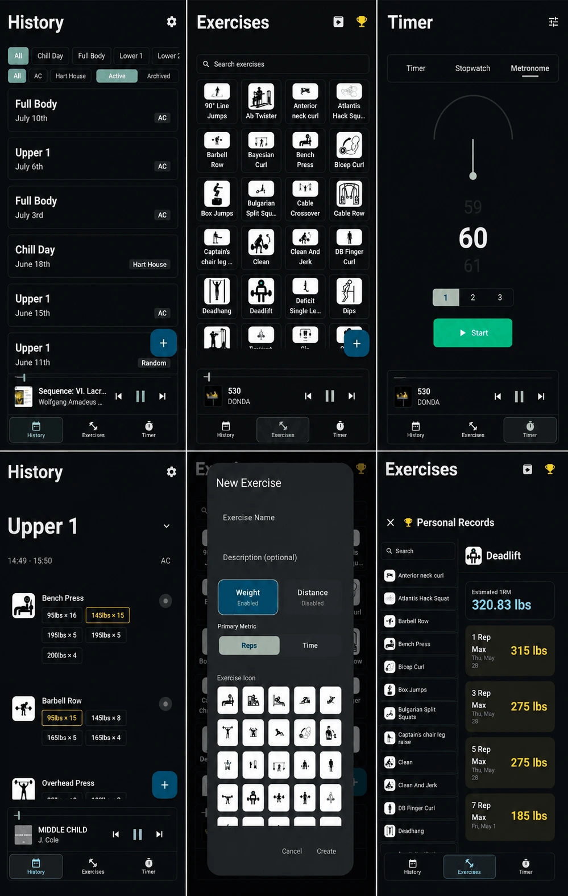

# Chiron


Chiron is a high-speed, customizable, and feature-rich workout tracker designed to get rid of all the bloat, recommendations, lack of customization, and tracking that's found in virtually every other app. It is designed to be clean, fast, offline-first, and highly tailored to standard and complex training metrics.

Download the version for your device from the [releases tab](https://github.com/intelligent-username/Chiron/releases).

---

## The Three Core Tabs



Chiron is organized into three central tabs to streamline your training workflow:

### 1. History Tab (Workout Tracking & Logs)

The central hub for logging workouts in real-time and reviewing past sessions:

*   **Session Editor:** Compose workouts dynamically, containing individual exercises, sets, reps, weight, distance, and duration.
*   **Supersets:** Link consecutive exercises into functional supersets with an integrated grouping UI.
*   **Performance Comparison:** Quickly view your "Previous" performance directly within each card to see exactly what targets you need to match or beat.
*   **Workout Management:** Easily duplicate past workouts to repeat previous routines.
*   **Dynamic Metadata:** Log names and locations, automatically sorted by recency and searchable via autocomplete/filters.

### 2. Exercises Tab (Exercise Directory & Personal Records)

A clean, modern directory for managing exercises and checking peak strength achievements:

*   **Categorical PR Tracking:** Supports polymorphic calculations for all exercise types:
    *   *Weight & Reps:* Highest weight achieved per repetition count with 1RM estimations.
    *   *Time & Weight:* Longest duration held for a given weight.
    *   *Distance & Weight (Rep-Based):* Tracks weight achieved for specific distance/repetition buckets.
    *   *Distance & Weight (Non-Rep):* Tracks longest distance achieved per weight.
    *   *Distance & Time:* Fastest duration achieved for a given distance.
*   **Interactive PR Details:** High-fidelity detail panel featuring a horizontal sliding pill selector to filter PR metrics by distance category (e.g., box jump heights).
*   **Modern Creator:** Clean, card-based interface for building custom exercises with toggle options and segmented selectors.
*   **Directory Management:** Quick filters, search, and archiving/unarchiving of unused exercises.

### 3. Utilities Tab (Timer & Stopwatch)
Dedicated pacing tools to keep your workouts on schedule:
*   **Timer & Stopwatch:** Multi-mode timers featuring customizable preset sheets.
*   **Metronome:** Integrated metronome tool for pacing tempo training and cadence.

---

## Special Features

*   **Offline Spotify Mini-Player:** A floating mini-player bar that communicates locally with the on-device Spotify app via IPC. Features interactive controls, gesture expansion, a custom animated wave seek slider, and offline support for Spotify Premium users.

*   **Advanced Volume Statistics:** In-app volume estimation calculated using category-specific SQL equations:
    *   *Distance + Reps + Weight:* $\text{Weight} \times \text{Reps} \times (\text{Distance} \times 2.0)$
    *   *Distance + Weight:* $\text{Weight} \times \frac{\text{Distance}}{5.0}$
    *   *Time + Weight:* $\text{Weight} \times \frac{\text{Duration}}{3.0}$

*   **Import / Export:** Clean database backup and recovery utilities to export or restore all workout metrics and history.
*   **Unit Preferences:** Seamless conversions between Metric (Kg, Meters) and Imperial (Lbs, Feet/Inches).


---

##  Compilation


First, make sure you have [JDK](https://www.oracle.com/java/technologies/downloads/) and [Gradle](https://docs.gradle.org/current/userguide/installation.html) installed.

Run:

```bash
.\gradlew.bat assembleDebug
```

This will assemble a debug version of the app, which is a less optimized in terms of Android performance but it's easier for the developer to test the app with.

All the most recent releases have been official release builds.

Run:

```bash
.\gradlew.bat assembleRelease
```

For assembling an actual release build. (Note that you'll need a proper `keystore.properties` file with the right credentials to sign the app, otherwise pre-existing versions of it won't update.)

And look the file at `app\build\outputs\apk\debug\app-debug.apk`

For official builds, check the [releases](https://github.com/intelligent-username/Chiron/releases).

To develop on your own, I recommend [Android Studio](https://developer.android.com/studio).

Download your respective installer to download the app. Then, you can run it like any other app. For Spotify integration, you'll need to log in with your Spotify account on the Spotify app first (this is a feature required by Spotify itself).

---

## License

This project is licensed under the Apache 2.0 License.
